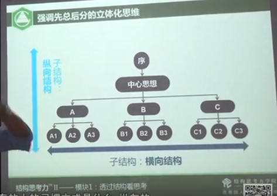
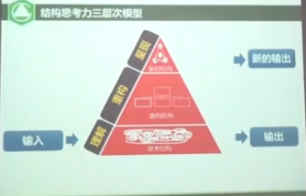
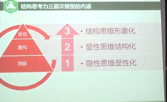
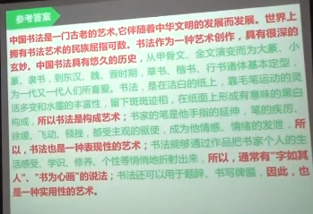
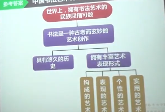
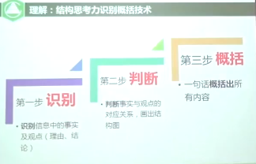

## 结构思考力的作用

帮助我们提升思考，增强表达能力
一个简单例子：把200ml的水装入100ml的杯子里可以采用什么方法？
通过结构化的思考，可以避免以经验，知识及个人的主观思维达成片面或非最优的结论。
从不同的角度看问题形成结构思考力。如下图示：

整个结构思考力来自于明托的金字塔原理，强调总分总的形式，但是要均衡横向与纵向思维的能力。

**结构思考力的核心内涵**
理解，重构，呈现

更详细就是：
- 隐性思维的显性化；
- 显性思维的结构化；
- 结构思维的形象化；

首先通过一个文章来做隐性思维显性化的能力构筑。

标红的是观点。 
成为结论得有依据，需要别的观点与依据进行支撑与证明。标红的是观点。 
通过寻找相关的对应关系就可以形成如下一张图。

1. 需要识别哪些是事实，哪些是观点
2. 需要评判相互之间的对应关系；
3. 采用一名话或一张图概括出其观点；

所以，理解隐性思维的显性化需要经历如下3个步骤：

